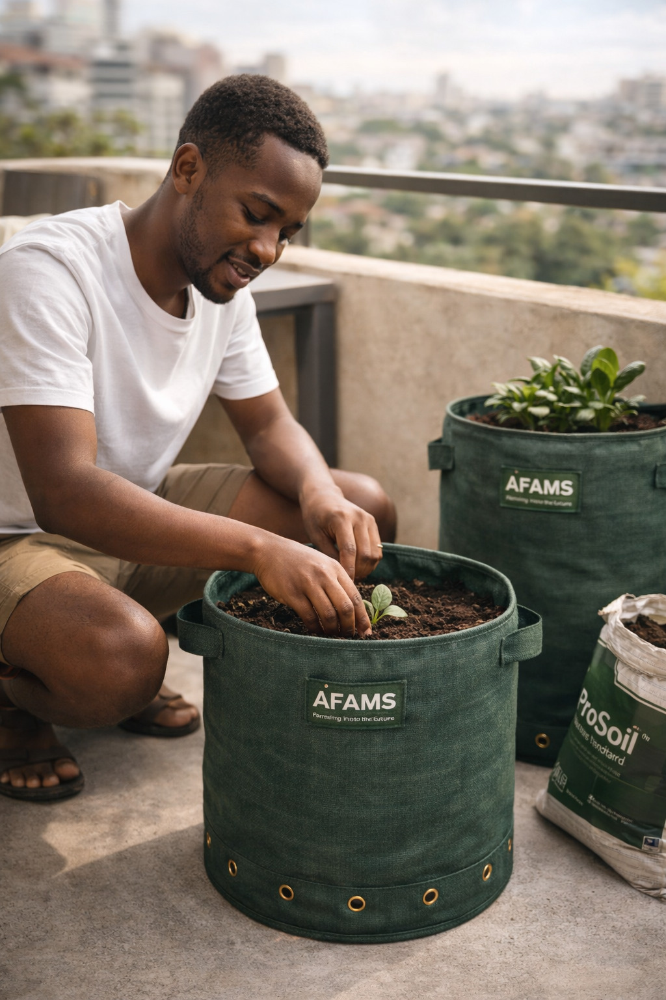

# Copilot Prompt — 02: Render GrowBag in the Existing Products Section
# Scope: Add a GrowBag product card (with size + variant selector) to the existing
#        #products section in index.html, below the three existing product cards.
# Rule: Do NOT modify, move, or reorder existing product cards.
#       Do NOT change cart JS, Paystack, Supabase, or checkout logic.
#       Only ADD new HTML and minimal new CSS/JS.

---

## Context

The site has a products section (id="products") in index.html that currently shows
three product cards: FarmBag Classic, FarmBag Vertical, and ProSoil.

Each card follows an existing HTML pattern — find it by inspecting the existing cards.
The GrowBag card must look like it belongs in the same section, using the same card
component structure, same CSS classes, and same "Add to Cart" mechanism.

The GrowBag has 5 sizes × 2 variants = 10 SKUs. Rather than showing 10 separate cards,
we show ONE GrowBag card with an interactive size/variant selector that updates the
price, SKU, volume, and "Add to Cart" button dynamically.

---

## Step 1 — Add a section divider before GrowBag

Before the GrowBag card, add a subtle divider with a label inside the existing
products grid/section. This visually separates the GrowBag from the FarmBag range
without breaking the existing layout:

```html
<!-- GrowBag divider — insert after last existing product card -->
<div class="product-divider" style="
  grid-column: 1 / -1;
  padding: 32px 0 8px;
  border-top: 1px solid rgba(255,255,255,0.12);
  margin-top: 16px;
">
  <p style="
    font-size: 11px;
    text-transform: uppercase;
    letter-spacing: 0.1em;
    color: #52B788;
    font-weight: 600;
    margin: 0;
  ">Also available · The GrowBag Range</p>
  <p style="
    font-size: 14px;
    color: rgba(255,255,255,0.55);
    margin: 4px 0 0;
    font-weight: 400;
  ">No irrigation system. Just a well-made bag that grows food.</p>
</div>
```

Note: `grid-column: 1 / -1` makes the divider span the full width regardless of
how many columns the product grid has — works for 2-col, 3-col, and 1-col layouts.

---

## Step 2 — Add the GrowBag product card

After the divider, add the following card. Match the outer card HTML structure —
class names, wrapper divs, image container, etc. — to whatever the existing product
cards use. The internal selector UI is new, but the card shell must look identical
to the other cards.

```html
<!-- ═══ AFAMS GROWBAG CARD ═══ -->
<div class="product-card" id="growbag-card">  <!-- use same class as existing cards -->

  <!-- Product image -->
  <div class="product-card-image">  <!-- use same image wrapper class as existing cards -->
    
    <!-- Badge -->
    <div id="growbag-badge" class="product-badge" style="
      display: inline-block;
      background: #B5820A;
      color: #fff;
      font-size: 11px;
      font-weight: 600;
      padding: 3px 10px;
      border-radius: 20px;
      letter-spacing: 0.05em;
    ">Most Popular</div>
  </div>

  <!-- Card body -->
  <div class="product-card-body">  <!-- use same body wrapper class as existing cards -->

    <!-- Product name and tagline -->
    <p class="product-card-label" style="
      font-size: 11px; text-transform: uppercase; letter-spacing: 0.08em;
      color: #52B788; font-weight: 600; margin: 0 0 4px;
    ">GrowBag · Basic Range</p>

    <h3 class="product-card-name" id="growbag-name">
      GrowBag Standard — Wide
    </h3>

    <p class="product-card-tagline" style="
      font-size: 13px; color: rgba(255,255,255,0.6); margin: 4px 0 16px;
    " id="growbag-volume">32 litres · PP geotextile · Bonded liner</p>

    <!-- ── SIZE SELECTOR ── -->
    <div class="growbag-selector" style="margin-bottom: 14px;">
      <p style="font-size: 12px; font-weight: 600; color: rgba(255,255,255,0.7);
                margin: 0 0 8px; text-transform: uppercase; letter-spacing: 0.06em;">
        Size
      </p>
      <div id="growbag-size-btns" style="display: flex; gap: 8px; flex-wrap: wrap;">
        <button class="gb-size-btn gb-size-active" data-size="Mini"     onclick="selectGrowBagSize('Mini')">Mini</button>
        <button class="gb-size-btn"                data-size="Medium"   onclick="selectGrowBagSize('Medium')">Medium</button>
        <button class="gb-size-btn gb-size-active" data-size="Standard" onclick="selectGrowBagSize('Standard')">Standard</button>
        <button class="gb-size-btn"                data-size="Large"    onclick="selectGrowBagSize('Large')">Large</button>
        <button class="gb-size-btn"                data-size="XL"       onclick="selectGrowBagSize('XL')">XL</button>
      </div>
    </div>

    <!-- ── VARIANT SELECTOR ── -->
    <div class="growbag-selector" style="margin-bottom: 20px;">
      <p style="font-size: 12px; font-weight: 600; color: rgba(255,255,255,0.7);
                margin: 0 0 8px; text-transform: uppercase; letter-spacing: 0.06em;">
        Shape
      </p>
      <div id="growbag-variant-btns" style="display: flex; gap: 8px;">
        <button class="gb-variant-btn gb-variant-active" data-variant="Wide"
                onclick="selectGrowBagVariant('Wide')"
                title="Broad and squat — best where width is available">
          Wide
        </button>
        <button class="gb-variant-btn" data-variant="Compact"
                onclick="selectGrowBagVariant('Compact')"
                title="Narrower and taller — best for tight spaces">
          Compact
        </button>
      </div>
      <p id="growbag-variant-desc" style="
        font-size: 12px; color: rgba(255,255,255,0.45); margin: 6px 0 0; line-height: 1.5;
      ">Broad and squat. Best for balconies and rooftops.</p>
    </div>

    <!-- Best for crops -->
    <div id="growbag-crops" style="
      display: flex; flex-wrap: wrap; gap: 6px; margin-bottom: 16px;
    ">
      <!-- Rendered by JS based on selected size -->
    </div>

    <!-- Price and CTA -->
    <div style="display: flex; align-items: center; justify-content: space-between; gap: 12px;">
      <div>
        <p style="font-size: 11px; color: rgba(255,255,255,0.5); margin: 0;">From</p>
        <p style="font-size: 1.5rem; font-weight: 700; color: #fff; margin: 0;"
           id="growbag-price">KES 1,050</p>
      </div>
      <button
        class="btn-add-to-cart"   <!-- use same CTA button class as existing cards -->
        id="growbag-cta"
        onclick="addGrowBagToCart()"
        style="white-space: nowrap;"
      >
        Add to Cart →
      </button>
    </div>

  </div>
</div>
<!-- ═══ END GROWBAG CARD ═══ -->
```

---

## Step 3 — Add selector button styles

Add these styles either in the existing CSS file or in a `<style>` block in index.html.
Do not override any existing styles — these are scoped to `.gb-size-btn` and
`.gb-variant-btn` which are new class names:

```css
/* GrowBag size/variant selector buttons */
.gb-size-btn,
.gb-variant-btn {
  padding: 6px 14px;
  font-size: 13px;
  font-weight: 500;
  border-radius: 6px;
  border: 1px solid rgba(255, 255, 255, 0.25);
  background: transparent;
  color: rgba(255, 255, 255, 0.7);
  cursor: pointer;
  transition: all 0.15s ease;
  font-family: inherit;
}

.gb-size-btn:hover,
.gb-variant-btn:hover {
  border-color: #52B788;
  color: #fff;
}

/* Active state — forest green fill */
.gb-size-btn.gb-size-active,
.gb-variant-btn.gb-variant-active {
  background: #2D6A4F;
  border-color: #52B788;
  color: #fff;
}
```

---

## Step 4 — Add GrowBag selector JavaScript

Add the following JS block either at the bottom of the main JS file or in a
`<script>` tag before `</body>` in index.html. Do NOT modify any existing JS.

```javascript
// ═══ GROWBAG SELECTOR ═══
// State
let gbSelectedSize    = 'Standard';
let gbSelectedVariant = 'Wide';

// Data — mirrors the 10 SKUs added in Prompt 01
const GB_DATA = {
  Mini:     { wide: { sku: 'GB-MINI-W',  price: 550,   volume: '8 L'  },
              compact: { sku: 'GB-MINI-C',  price: 500,   volume: '6 L'  },
              crops: ['Herbs', 'Chillies', 'Spring onions', 'Microgreens'] },
  Medium:   { wide: { sku: 'GB-MED-W',   price: 850,   volume: '17 L' },
              compact: { sku: 'GB-MED-C',   price: 800,   volume: '14 L' },
              crops: ['Spinach', 'Sukuma wiki', 'Capsicum', 'Lettuce'] },
  Standard: { wide: { sku: 'GB-STD-W',   price: 1050,  volume: '32 L' },
              compact: { sku: 'GB-STD-C',   price: 950,   volume: '28 L' },
              crops: ['Kale', 'Beans', 'Capsicum', 'Coriander', 'Spinach'] },
  Large:    { wide: { sku: 'GB-LRG-W',   price: 1450,  volume: '50 L' },
              compact: { sku: 'GB-LRG-C',   price: 1350,  volume: '44 L' },
              crops: ['Tomatoes', 'Aubergine', 'Large kale', 'Capsicum'] },
  XL:       { wide: { sku: 'GB-XL-W',    price: 1950,  volume: '70 L' },
              compact: { sku: 'GB-XL-C',    price: 1800,  volume: '62 L' },
              crops: ['Tomatoes', 'Sweet potato', 'Multi-plant', 'Large crops'] },
};

const GB_VARIANT_DESC = {
  Wide:    'Broad and squat. Best for balconies and rooftops.',
  Compact: 'Narrower and taller. Best for tight corners and small spaces.',
};

function getGBCurrent() {
  const sizeData = GB_DATA[gbSelectedSize];
  return gbSelectedVariant === 'Wide' ? sizeData.wide : sizeData.compact;
}

function updateGrowBagCard() {
  const current  = getGBCurrent();
  const sizeData = GB_DATA[gbSelectedSize];

  // Name
  document.getElementById('growbag-name').textContent =
    `GrowBag ${gbSelectedSize} — ${gbSelectedVariant}`;

  // Volume / material line
  document.getElementById('growbag-volume').textContent =
    `${current.volume} · PP geotextile · Bonded liner`;

  // Price
  document.getElementById('growbag-price').textContent =
    'KES ' + current.price.toLocaleString('en-KE');

  // Badge — only Standard Wide gets 'Most Popular'
  const badge = document.getElementById('growbag-badge');
  if (gbSelectedSize === 'Standard' && gbSelectedVariant === 'Wide') {
    badge.textContent = 'Most Popular';
    badge.style.display = 'inline-block';
  } else {
    badge.style.display = 'none';
  }

  // Variant description
  document.getElementById('growbag-variant-desc').textContent =
    GB_VARIANT_DESC[gbSelectedVariant];

  // Crops
  const cropsEl = document.getElementById('growbag-crops');
  cropsEl.innerHTML = sizeData.crops.map(crop => `
    <span style="
      background: rgba(82,183,136,0.15);
      color: #52B788;
      border: 1px solid rgba(82,183,136,0.3);
      font-size: 11px;
      font-weight: 500;
      padding: 3px 10px;
      border-radius: 20px;
    ">${crop}</span>
  `).join('');

  // Update CTA data attribute for addGrowBagToCart
  document.getElementById('growbag-cta').dataset.sku = current.sku;
}

function selectGrowBagSize(size) {
  gbSelectedSize = size;
  // Update active button
  document.querySelectorAll('.gb-size-btn').forEach(btn => {
    btn.classList.toggle('gb-size-active', btn.dataset.size === size);
  });
  updateGrowBagCard();
}

function selectGrowBagVariant(variant) {
  gbSelectedVariant = variant;
  // Update active button
  document.querySelectorAll('.gb-variant-btn').forEach(btn => {
    btn.classList.toggle('gb-variant-active', btn.dataset.variant === variant);
  });
  updateGrowBagCard();
}

function addGrowBagToCart() {
  const current = getGBCurrent();
  const productName = `GrowBag ${gbSelectedSize} — ${gbSelectedVariant}`;

  // Call the existing addToCart function with the resolved SKU and name.
  // Inspect the existing addToCart signature and pass parameters accordingly.
  // Common patterns — use whichever matches the existing code:

  // Pattern A: addToCart(sku, name, price, qty)
  // addToCart(current.sku, productName, current.price, 1);

  // Pattern B: addToCart(productObject)
  // addToCart({ sku: current.sku, name: productName, price: current.price, qty: 1 });

  // Pattern C: addToCart(sku, qty) — price resolved internally from products array
  // addToCart(current.sku, 1);

  // → Find the existing addToCart call on the FarmBag Classic "Add to Cart" button
  //   and replicate the exact same call pattern here for the GrowBag.
}

// Initialise card on page load
document.addEventListener('DOMContentLoaded', () => {
  // Set Standard as default active size button
  document.querySelector('.gb-size-btn[data-size="Standard"]')
    ?.classList.add('gb-size-active');
  updateGrowBagCard();
});
// ═══ END GROWBAG SELECTOR ═══
```

---

## Step 5 — Update cart display for GrowBag SKUs

The cart sidebar/modal already shows product name and price for items added via the
existing addToCart function. GrowBag SKUs follow the same flow — no separate cart logic
needed — BUT confirm the following:

1. Find where the cart resolves a product's display name from its SKU.
2. Confirm that GrowBag SKUs (GB-MINI-W, GB-STD-C, etc.) will resolve correctly — either
   because the cart uses the name passed at addToCart time, OR because it looks up the
   products array. If it looks up the products array, the entries from Prompt 01 will
   handle this automatically.
3. If the cart only uses a hardcoded SKU→name map, add the 10 GrowBag entries to that
   map — do not rewrite the cart logic.

---

## Step 6 — Update the footer product list

Find the footer section of index.html. It currently lists:
```
FarmBag Classic
FarmBag Vertical
```
Add GrowBag below these two without removing them:
```html
<li><a href="#products">GrowBag Range</a></li>
```

---

## Checklist after implementation
- [ ] GrowBag card appears in the #products section after the three existing cards
- [ ] Divider with "The GrowBag Range" label renders above the card, full width
- [ ] Size buttons (Mini / Medium / Standard / Large / XL) all work
- [ ] Variant buttons (Wide / Compact) both work
- [ ] Selecting any combination updates name, volume, price, badge, and crops correctly
- [ ] "Most Popular" badge shows only for Standard + Wide
- [ ] "Add to Cart →" adds the correct SKU and price to the existing cart
- [ ] Cart total updates correctly when GrowBag is added
- [ ] Existing three product cards are completely unchanged
- [ ] Checkout and Paystack flow works with a GrowBag in the cart
- [ ] Footer "Products" list now includes "GrowBag Range" link
- [ ] Card is responsive — selector buttons wrap cleanly on mobile (375px viewport)
- [ ] No JS errors in browser console on page load or after selections
